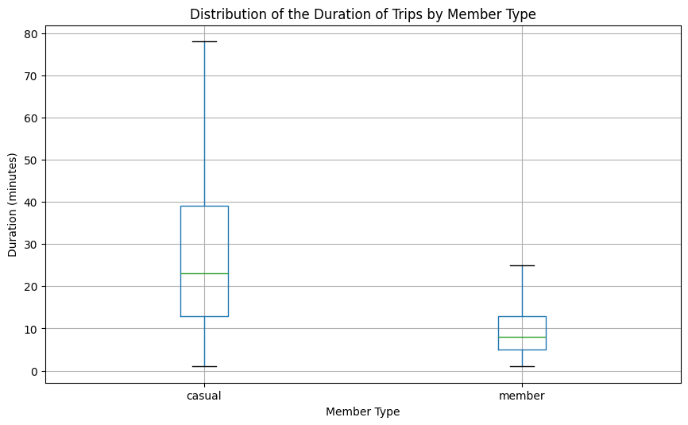
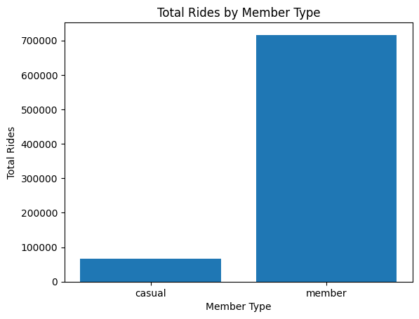
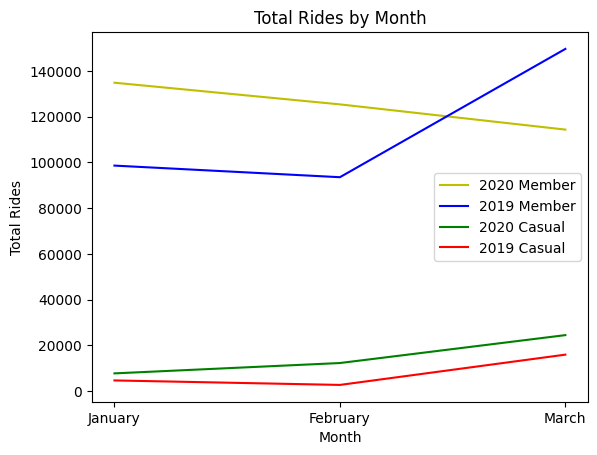
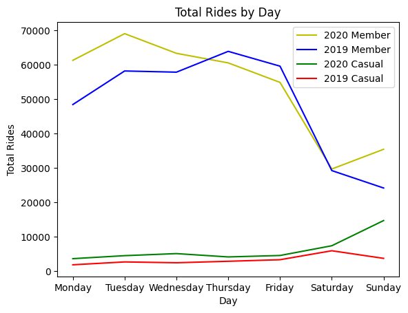
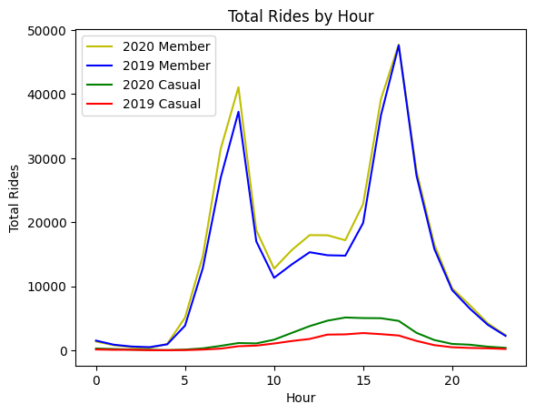
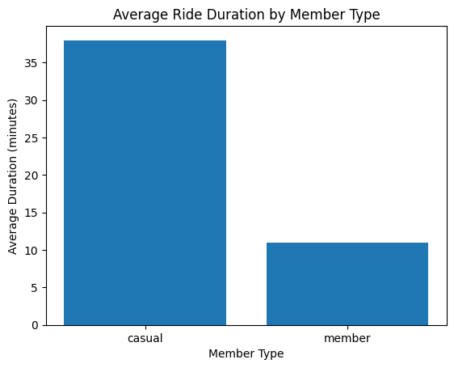
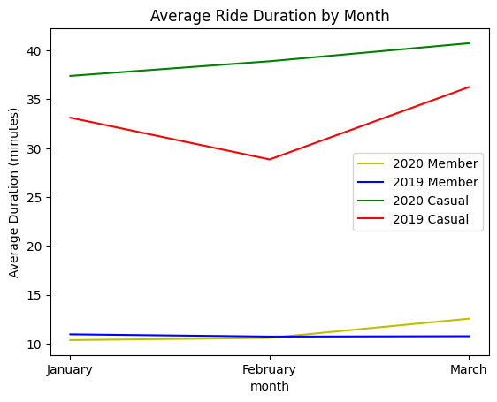
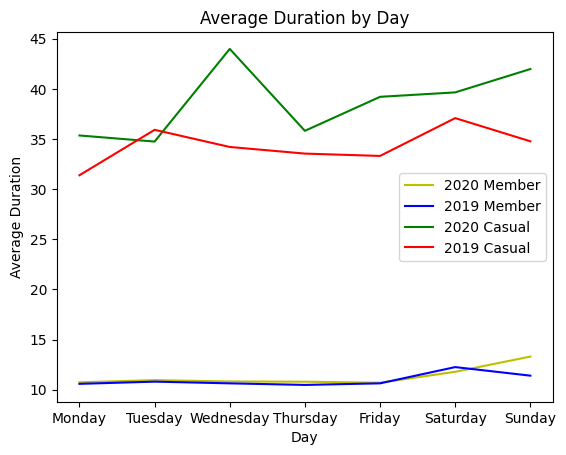
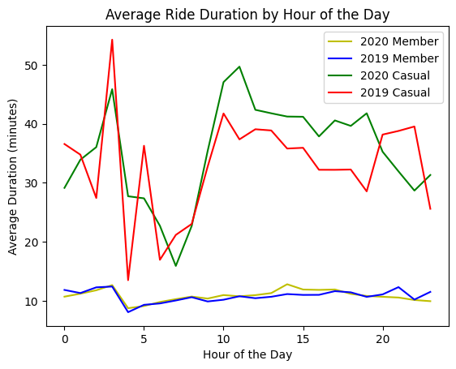

# 1. **Introduction**

This case study is the ***[Capstone Project](https://www.coursera.org/learn/google-data-analytics-capstone)*** of the ***[Google Data Analytics Professional Certificate](https://www.coursera.org/professional-certificates/google-data-analytics)*** . In this case study I am working as a junior data analyst in the marketing analyst team at Cyclistic, a fictional bike-share company in Chicago. 

The company's marketing strategy has been to attract different types of customers by offering single-ride passes, full-day passes, and annual memberships. **Customers that opt for annual memberships are considered Cyclistic members and the others are considered as casual riders**.

Cyclistic's financial analysts have determined that annual members are more profitable than casual riders and that future growth depends on converting casual riders into members. 

The director of marketing assigned me the task of determining **how annual members and casual members use Cyclistic bikes differently**. This information will help inform a marketing strategy that focuses on casual riders and how they could benefit from becoming members.

To answer this business task, I will follow the data analysis process of **ask**, **prepare**, **process**, **analyze**, **share**, and **act**.

# 2. **Ask**

**Key Task**: **How do annual members and casual members use Cyclistic bikes differently?**

**Key Stakeholders**: 
- **Lily Moreno** - The director of marketing and my manager.
- **Cyclistic executive team** - Team that will decide whether to approve the recommended marketing program.

# 3. **Prepare**

- Cyclistic is a fictional company so the data provided comes from a similar but real company **Bikeshare** under this ***[license](https://www.divvybikes.com/data-license-agreement)***

- The **data** I was given comes from ***[Cyclistic’s Historical Trip Data](https://divvy-tripdata.s3.amazonaws.com/index.html)***. 

- Only data from **the first quarter of 2019 and 2020** is used.

- The data is stored in **CSV** files. There is a file for **Q1 2019** and **Q2 2020**. 

- Each file contains data from **January through March**.

- The data is **structured**

- This data is collected by **Bikeshare**, the parent company of **Divvy** in the city of Chicago. The data is taken from the bikes and provided by the company itself. This makes the data **accurate** and **trustworthy**.

Limits:

- The data does not contain financial information which could be helpful to determine if casual riders may benefit from joining the membership. 

- The data is not **consistent** as the two datasets provided have different columns where the first is more focused on the user and the second is more focused on the trip information. The data will need to be processed to compare only related fields.

# 4. **Process**


```python
import pandas as pd
import matplotlib.pyplot as plt

# Read the data from the CSV file
data_2019 = pd.read_csv('Divvy_Trips_2019_Q1.csv')
data_2020 = pd.read_csv('Divvy_Trips_2020_Q1.csv')
```


```python
# Check column names
print(data_2019.columns)
print(data_2020.columns)
```

    Index(['trip_id', 'start_time', 'end_time', 'bikeid', 'tripduration',
           'from_station_id', 'from_station_name', 'to_station_id',
           'to_station_name', 'usertype', 'gender', 'birthyear'],
          dtype='object')
    Index(['ride_id', 'rideable_type', 'started_at', 'ended_at',
           'start_station_name', 'start_station_id', 'end_station_name',
           'end_station_id', 'start_lat', 'start_lng', 'end_lat', 'end_lng',
           'member_casual'],
          dtype='object')
    


```python
# Rename columns for consistency
data_2019 = data_2019.rename(columns={"trip_id": "ride_id",
                                      "bikeid": "rideable_type",
                                      "start_time": "started_at",
                                      "end_time": "ended_at",
                                      "from_station_id": "start_station_id",
                                      "from_station_name": "start_station_name",
                                      "to_station_id": "end_station_id",
                                      "to_station_name": "end_station_name",
                                      "usertype": "member_casual"})

# display structure of the data
data_2019.info()
```

    <class 'pandas.core.frame.DataFrame'>
    RangeIndex: 365069 entries, 0 to 365068
    Data columns (total 12 columns):
     #   Column              Non-Null Count   Dtype  
    ---  ------              --------------   -----  
     0   ride_id             365069 non-null  int64  
     1   started_at          365069 non-null  object 
     2   ended_at            365069 non-null  object 
     3   rideable_type       365069 non-null  int64  
     4   tripduration        365069 non-null  object 
     5   start_station_id    365069 non-null  int64  
     6   start_station_name  365069 non-null  object 
     7   end_station_id      365069 non-null  int64  
     8   end_station_name    365069 non-null  object 
     9   member_casual       365069 non-null  object 
     10  gender              345358 non-null  object 
     11  birthyear           347046 non-null  float64
    dtypes: float64(1), int64(4), object(7)
    memory usage: 33.4+ MB
    


```python
# display the structure of the data
data_2020.info()
```

    <class 'pandas.core.frame.DataFrame'>
    RangeIndex: 426887 entries, 0 to 426886
    Data columns (total 13 columns):
     #   Column              Non-Null Count   Dtype  
    ---  ------              --------------   -----  
     0   ride_id             426887 non-null  object 
     1   rideable_type       426887 non-null  object 
     2   started_at          426887 non-null  object 
     3   ended_at            426887 non-null  object 
     4   start_station_name  426887 non-null  object 
     5   start_station_id    426887 non-null  int64  
     6   end_station_name    426886 non-null  object 
     7   end_station_id      426886 non-null  float64
     8   start_lat           426887 non-null  float64
     9   start_lng           426887 non-null  float64
     10  end_lat             426886 non-null  float64
     11  end_lng             426886 non-null  float64
     12  member_casual       426887 non-null  object 
    dtypes: float64(5), int64(1), object(7)
    memory usage: 42.3+ MB
    

Since ride_id and rideable_type are different Dtypes, they must be converted to match


```python
data_2019.ride_id = data_2019.ride_id.astype(str)
data_2019.rideable_type = data_2019.rideable_type.astype(str)
```


```python
data_2019.head()
```


<div>
<style scoped>
    .dataframe tbody tr th:only-of-type {
        vertical-align: middle;
    }

    .dataframe tbody tr th {
        vertical-align: top;
    }

    .dataframe thead th {
        text-align: right;
    }
</style>
<table border="1" class="dataframe">
  <thead>
    <tr style="text-align: right;">
      <th></th>
      <th>ride_id</th>
      <th>started_at</th>
      <th>ended_at</th>
      <th>rideable_type</th>
      <th>tripduration</th>
      <th>start_station_id</th>
      <th>start_station_name</th>
      <th>end_station_id</th>
      <th>end_station_name</th>
      <th>member_casual</th>
      <th>gender</th>
      <th>birthyear</th>
    </tr>
  </thead>
  <tbody>
    <tr>
      <th>0</th>
      <td>21742443</td>
      <td>2019-01-01 0:04:37</td>
      <td>2019-01-01 0:11:07</td>
      <td>2167</td>
      <td>390</td>
      <td>199</td>
      <td>Wabash Ave &amp; Grand Ave</td>
      <td>84</td>
      <td>Milwaukee Ave &amp; Grand Ave</td>
      <td>Subscriber</td>
      <td>Male</td>
      <td>1989.0</td>
    </tr>
    <tr>
      <th>1</th>
      <td>21742444</td>
      <td>2019-01-01 0:08:13</td>
      <td>2019-01-01 0:15:34</td>
      <td>4386</td>
      <td>441</td>
      <td>44</td>
      <td>State St &amp; Randolph St</td>
      <td>624</td>
      <td>Dearborn St &amp; Van Buren St (*)</td>
      <td>Subscriber</td>
      <td>Female</td>
      <td>1990.0</td>
    </tr>
    <tr>
      <th>2</th>
      <td>21742445</td>
      <td>2019-01-01 0:13:23</td>
      <td>2019-01-01 0:27:12</td>
      <td>1524</td>
      <td>829</td>
      <td>15</td>
      <td>Racine Ave &amp; 18th St</td>
      <td>644</td>
      <td>Western Ave &amp; Fillmore St (*)</td>
      <td>Subscriber</td>
      <td>Female</td>
      <td>1994.0</td>
    </tr>
    <tr>
      <th>3</th>
      <td>21742446</td>
      <td>2019-01-01 0:13:45</td>
      <td>2019-01-01 0:43:28</td>
      <td>252</td>
      <td>1,783.00</td>
      <td>123</td>
      <td>California Ave &amp; Milwaukee Ave</td>
      <td>176</td>
      <td>Clark St &amp; Elm St</td>
      <td>Subscriber</td>
      <td>Male</td>
      <td>1993.0</td>
    </tr>
    <tr>
      <th>4</th>
      <td>21742447</td>
      <td>2019-01-01 0:14:52</td>
      <td>2019-01-01 0:20:56</td>
      <td>1170</td>
      <td>364</td>
      <td>173</td>
      <td>Mies van der Rohe Way &amp; Chicago Ave</td>
      <td>35</td>
      <td>Streeter Dr &amp; Grand Ave</td>
      <td>Subscriber</td>
      <td>Male</td>
      <td>1994.0</td>
    </tr>
  </tbody>
</table>
</div>


```python
data_2020.head()
```


<div>
<style scoped>
    .dataframe tbody tr th:only-of-type {
        vertical-align: middle;
    }

    .dataframe tbody tr th {
        vertical-align: top;
    }

    .dataframe thead th {
        text-align: right;
    }
</style>
<table border="1" class="dataframe">
  <thead>
    <tr style="text-align: right;">
      <th></th>
      <th>ride_id</th>
      <th>rideable_type</th>
      <th>started_at</th>
      <th>ended_at</th>
      <th>start_station_name</th>
      <th>start_station_id</th>
      <th>end_station_name</th>
      <th>end_station_id</th>
      <th>start_lat</th>
      <th>start_lng</th>
      <th>end_lat</th>
      <th>end_lng</th>
      <th>member_casual</th>
    </tr>
  </thead>
  <tbody>
    <tr>
      <th>0</th>
      <td>EACB19130B0CDA4A</td>
      <td>docked_bike</td>
      <td>2020-01-21 20:06:59</td>
      <td>2020-01-21 20:14:30</td>
      <td>Western Ave &amp; Leland Ave</td>
      <td>239</td>
      <td>Clark St &amp; Leland Ave</td>
      <td>326.0</td>
      <td>41.9665</td>
      <td>-87.6884</td>
      <td>41.9671</td>
      <td>-87.6674</td>
      <td>member</td>
    </tr>
    <tr>
      <th>1</th>
      <td>8FED874C809DC021</td>
      <td>docked_bike</td>
      <td>2020-01-30 14:22:39</td>
      <td>2020-01-30 14:26:22</td>
      <td>Clark St &amp; Montrose Ave</td>
      <td>234</td>
      <td>Southport Ave &amp; Irving Park Rd</td>
      <td>318.0</td>
      <td>41.9616</td>
      <td>-87.6660</td>
      <td>41.9542</td>
      <td>-87.6644</td>
      <td>member</td>
    </tr>
    <tr>
      <th>2</th>
      <td>789F3C21E472CA96</td>
      <td>docked_bike</td>
      <td>2020-01-09 19:29:26</td>
      <td>2020-01-09 19:32:17</td>
      <td>Broadway &amp; Belmont Ave</td>
      <td>296</td>
      <td>Wilton Ave &amp; Belmont Ave</td>
      <td>117.0</td>
      <td>41.9401</td>
      <td>-87.6455</td>
      <td>41.9402</td>
      <td>-87.6530</td>
      <td>member</td>
    </tr>
    <tr>
      <th>3</th>
      <td>C9A388DAC6ABF313</td>
      <td>docked_bike</td>
      <td>2020-01-06 16:17:07</td>
      <td>2020-01-06 16:25:56</td>
      <td>Clark St &amp; Randolph St</td>
      <td>51</td>
      <td>Fairbanks Ct &amp; Grand Ave</td>
      <td>24.0</td>
      <td>41.8846</td>
      <td>-87.6319</td>
      <td>41.8918</td>
      <td>-87.6206</td>
      <td>member</td>
    </tr>
    <tr>
      <th>4</th>
      <td>943BC3CBECCFD662</td>
      <td>docked_bike</td>
      <td>2020-01-30 8:37:16</td>
      <td>2020-01-30 8:42:48</td>
      <td>Clinton St &amp; Lake St</td>
      <td>66</td>
      <td>Wells St &amp; Hubbard St</td>
      <td>212.0</td>
      <td>41.8856</td>
      <td>-87.6418</td>
      <td>41.8899</td>
      <td>-87.6343</td>
      <td>member</td>
    </tr>
  </tbody>
</table>
</div>


Since some of the columns are different between the two sets, I will remove the incompatible columns.


```python
all_trips = pd.concat([data_2019, data_2020], ignore_index=True)
all_trips.drop(columns=['rideable_type', 'start_lat', 'start_lng', 'end_lat', 'end_lng', 'birthyear', 'gender', 'tripduration'], inplace=True)
all_trips.info()
```

    <class 'pandas.core.frame.DataFrame'>
    RangeIndex: 791956 entries, 0 to 791955
    Data columns (total 8 columns):
     #   Column              Non-Null Count   Dtype  
    ---  ------              --------------   -----  
     0   ride_id             791956 non-null  object 
     1   started_at          791956 non-null  object 
     2   ended_at            791956 non-null  object 
     3   start_station_id    791956 non-null  int64  
     4   start_station_name  791956 non-null  object 
     5   end_station_id      791955 non-null  float64
     6   end_station_name    791955 non-null  object 
     7   member_casual       791956 non-null  object 
    dtypes: float64(1), int64(1), object(6)
    memory usage: 48.3+ MB
    


```python
# get the duration by using the start and end time difference 
all_trips['duration'] = pd.to_datetime(all_trips.ended_at) - pd.to_datetime(all_trips.started_at)
all_trips.sort_values(by='duration')
```


<div>
<style scoped>
    .dataframe tbody tr th:only-of-type {
        vertical-align: middle;
    }

    .dataframe tbody tr th {
        vertical-align: top;
    }

    .dataframe thead th {
        text-align: right;
    }
</style>
<table border="1" class="dataframe">
  <thead>
    <tr style="text-align: right;">
      <th></th>
      <th>ride_id</th>
      <th>started_at</th>
      <th>ended_at</th>
      <th>start_station_id</th>
      <th>start_station_name</th>
      <th>end_station_id</th>
      <th>end_station_name</th>
      <th>member_casual</th>
      <th>duration</th>
    </tr>
  </thead>
  <tbody>
    <tr>
      <th>699203</th>
      <td>6FABADDD595AF922</td>
      <td>2020-03-27 15:15:26</td>
      <td>2020-03-27 15:06:14</td>
      <td>675</td>
      <td>HQ QR</td>
      <td>675.0</td>
      <td>HQ QR</td>
      <td>casual</td>
      <td>-1 days +23:50:48</td>
    </tr>
    <tr>
      <th>653844</th>
      <td>13BCB74BAFDADB21</td>
      <td>2020-03-27 14:59:51</td>
      <td>2020-03-27 14:58:18</td>
      <td>675</td>
      <td>HQ QR</td>
      <td>675.0</td>
      <td>HQ QR</td>
      <td>casual</td>
      <td>-1 days +23:58:27</td>
    </tr>
    <tr>
      <th>715170</th>
      <td>867C195C5650C884</td>
      <td>2020-03-27 15:00:57</td>
      <td>2020-03-27 14:59:38</td>
      <td>675</td>
      <td>HQ QR</td>
      <td>675.0</td>
      <td>HQ QR</td>
      <td>casual</td>
      <td>-1 days +23:58:41</td>
    </tr>
    <tr>
      <th>682575</th>
      <td>3361A4413B4813B8</td>
      <td>2020-03-20 10:18:41</td>
      <td>2020-03-20 10:18:18</td>
      <td>675</td>
      <td>HQ QR</td>
      <td>675.0</td>
      <td>HQ QR</td>
      <td>casual</td>
      <td>-1 days +23:59:37</td>
    </tr>
    <tr>
      <th>777062</th>
      <td>B0565BEDAF8D721F</td>
      <td>2020-03-18 11:30:34</td>
      <td>2020-03-18 11:30:12</td>
      <td>675</td>
      <td>HQ QR</td>
      <td>675.0</td>
      <td>HQ QR</td>
      <td>casual</td>
      <td>-1 days +23:59:38</td>
    </tr>
    <tr>
      <th>...</th>
      <td>...</td>
      <td>...</td>
      <td>...</td>
      <td>...</td>
      <td>...</td>
      <td>...</td>
      <td>...</td>
      <td>...</td>
      <td>...</td>
    </tr>
    <tr>
      <th>246297</th>
      <td>22039457</td>
      <td>2019-03-12 18:48:41</td>
      <td>2019-05-22 8:15:49</td>
      <td>438</td>
      <td>Central Park Ave &amp; Ogden Ave</td>
      <td>508.0</td>
      <td>Central Park Ave &amp; North Ave</td>
      <td>Subscriber</td>
      <td>70 days 13:27:08</td>
    </tr>
    <tr>
      <th>525263</th>
      <td>ABA59A8FED82A85C</td>
      <td>2020-02-28 8:47:09</td>
      <td>2020-05-19 20:10:34</td>
      <td>526</td>
      <td>Oakley Ave &amp; Touhy Ave</td>
      <td>453.0</td>
      <td>Clark St &amp; Schreiber Ave</td>
      <td>casual</td>
      <td>81 days 11:23:25</td>
    </tr>
    <tr>
      <th>626364</th>
      <td>377B59F0A27BB4CB</td>
      <td>2020-02-02 17:18:57</td>
      <td>2020-05-12 16:15:42</td>
      <td>503</td>
      <td>Drake Ave &amp; Fullerton Ave</td>
      <td>29.0</td>
      <td>Noble St &amp; Milwaukee Ave</td>
      <td>casual</td>
      <td>99 days 22:56:45</td>
    </tr>
    <tr>
      <th>421464</th>
      <td>279F7DB076FD4444</td>
      <td>2020-01-09 21:00:22</td>
      <td>2020-04-27 12:30:46</td>
      <td>270</td>
      <td>Stony Island Ave &amp; 75th St</td>
      <td>355.0</td>
      <td>South Shore Dr &amp; 67th St</td>
      <td>casual</td>
      <td>108 days 15:30:24</td>
    </tr>
    <tr>
      <th>148897</th>
      <td>21920842</td>
      <td>2019-02-14 14:44:13</td>
      <td>2019-06-17 16:04:35</td>
      <td>213</td>
      <td>Leavitt St &amp; North Ave</td>
      <td>360.0</td>
      <td>DIVVY Map Frame B/C Station</td>
      <td>Customer</td>
      <td>123 days 01:20:22</td>
    </tr>
  </tbody>
</table>
<p>791956 rows × 9 columns</p>
</div>


```python
# From examining the data, we can see that there are some negative values in the duration column. 
all_trips[all_trips.duration < "0"].count()
```


    ride_id               117
    started_at            117
    ended_at              117
    start_station_id      117
    start_station_name    117
    end_station_id        116
    end_station_name      116
    member_casual         117
    duration              117
    dtype: int64


```python
# There are some trips with a duration of less than 1 minute which seems unlikely.
all_trips[all_trips.duration < "1 minute"].count()
```


    ride_id               7671
    started_at            7671
    ended_at              7671
    start_station_id      7671
    start_station_name    7671
    end_station_id        7670
    end_station_name      7670
    member_casual         7671
    duration              7671
    dtype: int64


```python
# There are some trips with a duration of more than a day which seems unlikely.
all_trips[all_trips.duration > "1 days"].count()
```


    ride_id               482
    started_at            482
    ended_at              482
    start_station_id      482
    start_station_name    482
    end_station_id        482
    end_station_name      482
    member_casual         482
    duration              482
    dtype: int64


```python
# Removing the values with a duration of less than 1 minute and values more than a day.
all_trips = all_trips[all_trips.duration >= "1 minute"]
all_trips = all_trips[all_trips.duration <= "1 days"]
all_trips = all_trips.reset_index()
all_trips = all_trips.drop(columns=['index'])
```


```python
# The two datasets have different values for the member_casual column. We will standardize the values to 'member' and 'casual'.
all_trips.loc[all_trips['member_casual'] == 'Subscriber', 'member_casual'] = 'member'
all_trips.loc[all_trips['member_casual'] == 'Customer', 'member_casual'] = 'casual'
```


```python
all_trips.shape
```


    (783803, 9)


```python
# Check for missing values
all_trips.isna().sum()
```


    ride_id               0
    started_at            0
    ended_at              0
    start_station_id      0
    start_station_name    0
    end_station_id        0
    end_station_name      0
    member_casual         0
    duration              0
    dtype: int64


```python
# Removing leading and trailing whitespaces in column "Ride Id".
all_trips['ride_id'] = all_trips['ride_id'].str.strip()

# View any duplicate rows.
all_trips[all_trips['ride_id'].duplicated()]
```


<div>
<style scoped>
    .dataframe tbody tr th:only-of-type {
        vertical-align: middle;
    }

    .dataframe tbody tr th {
        vertical-align: top;
    }

    .dataframe thead th {
        text-align: right;
    }
</style>
<table border="1" class="dataframe">
  <thead>
    <tr style="text-align: right;">
      <th></th>
      <th>ride_id</th>
      <th>started_at</th>
      <th>ended_at</th>
      <th>start_station_id</th>
      <th>start_station_name</th>
      <th>end_station_id</th>
      <th>end_station_name</th>
      <th>member_casual</th>
      <th>duration</th>
    </tr>
  </thead>
  <tbody>
  </tbody>
</table>
</div>


```python
# Add a column for the trip duration in minutes.
all_trips['duration'] = (all_trips['duration'].dt.total_seconds()/60).astype(int)
all_trips
```


<div>
<style scoped>
    .dataframe tbody tr th:only-of-type {
        vertical-align: middle;
    }

    .dataframe tbody tr th {
        vertical-align: top;
    }

    .dataframe thead th {
        text-align: right;
    }
</style>
<table border="1" class="dataframe">
  <thead>
    <tr style="text-align: right;">
      <th></th>
      <th>ride_id</th>
      <th>started_at</th>
      <th>ended_at</th>
      <th>start_station_id</th>
      <th>start_station_name</th>
      <th>end_station_id</th>
      <th>end_station_name</th>
      <th>member_casual</th>
      <th>duration</th>
    </tr>
  </thead>
  <tbody>
    <tr>
      <th>0</th>
      <td>21742443</td>
      <td>2019-01-01 0:04:37</td>
      <td>2019-01-01 0:11:07</td>
      <td>199</td>
      <td>Wabash Ave &amp; Grand Ave</td>
      <td>84.0</td>
      <td>Milwaukee Ave &amp; Grand Ave</td>
      <td>member</td>
      <td>6</td>
    </tr>
    <tr>
      <th>1</th>
      <td>21742444</td>
      <td>2019-01-01 0:08:13</td>
      <td>2019-01-01 0:15:34</td>
      <td>44</td>
      <td>State St &amp; Randolph St</td>
      <td>624.0</td>
      <td>Dearborn St &amp; Van Buren St (*)</td>
      <td>member</td>
      <td>7</td>
    </tr>
    <tr>
      <th>2</th>
      <td>21742445</td>
      <td>2019-01-01 0:13:23</td>
      <td>2019-01-01 0:27:12</td>
      <td>15</td>
      <td>Racine Ave &amp; 18th St</td>
      <td>644.0</td>
      <td>Western Ave &amp; Fillmore St (*)</td>
      <td>member</td>
      <td>13</td>
    </tr>
    <tr>
      <th>3</th>
      <td>21742446</td>
      <td>2019-01-01 0:13:45</td>
      <td>2019-01-01 0:43:28</td>
      <td>123</td>
      <td>California Ave &amp; Milwaukee Ave</td>
      <td>176.0</td>
      <td>Clark St &amp; Elm St</td>
      <td>member</td>
      <td>29</td>
    </tr>
    <tr>
      <th>4</th>
      <td>21742447</td>
      <td>2019-01-01 0:14:52</td>
      <td>2019-01-01 0:20:56</td>
      <td>173</td>
      <td>Mies van der Rohe Way &amp; Chicago Ave</td>
      <td>35.0</td>
      <td>Streeter Dr &amp; Grand Ave</td>
      <td>member</td>
      <td>6</td>
    </tr>
    <tr>
      <th>...</th>
      <td>...</td>
      <td>...</td>
      <td>...</td>
      <td>...</td>
      <td>...</td>
      <td>...</td>
      <td>...</td>
      <td>...</td>
      <td>...</td>
    </tr>
    <tr>
      <th>783798</th>
      <td>005D3BC2A3B33DDA</td>
      <td>2020-03-12 7:32:25</td>
      <td>2020-03-12 7:38:44</td>
      <td>91</td>
      <td>Clinton St &amp; Washington Blvd</td>
      <td>47.0</td>
      <td>State St &amp; Kinzie St</td>
      <td>member</td>
      <td>6</td>
    </tr>
    <tr>
      <th>783799</th>
      <td>82B10FA3994BC66A</td>
      <td>2020-03-07 15:25:55</td>
      <td>2020-03-07 16:14:03</td>
      <td>161</td>
      <td>Rush St &amp; Superior St</td>
      <td>240.0</td>
      <td>Sheridan Rd &amp; Irving Park Rd</td>
      <td>member</td>
      <td>48</td>
    </tr>
    <tr>
      <th>783800</th>
      <td>AA0D5AAA0B59C8AA</td>
      <td>2020-03-01 13:12:38</td>
      <td>2020-03-01 13:38:29</td>
      <td>141</td>
      <td>Clark St &amp; Lincoln Ave</td>
      <td>210.0</td>
      <td>Ashland Ave &amp; Division St</td>
      <td>casual</td>
      <td>25</td>
    </tr>
    <tr>
      <th>783801</th>
      <td>3296360A7BC20FB8</td>
      <td>2020-03-07 18:02:45</td>
      <td>2020-03-07 18:13:18</td>
      <td>672</td>
      <td>Franklin St &amp; Illinois St</td>
      <td>264.0</td>
      <td>Stetson Ave &amp; South Water St</td>
      <td>member</td>
      <td>10</td>
    </tr>
    <tr>
      <th>783802</th>
      <td>064EC7698E4FF9B3</td>
      <td>2020-03-08 13:03:57</td>
      <td>2020-03-08 13:32:27</td>
      <td>110</td>
      <td>Dearborn St &amp; Erie St</td>
      <td>85.0</td>
      <td>Michigan Ave &amp; Oak St</td>
      <td>casual</td>
      <td>28</td>
    </tr>
  </tbody>
</table>
<p>783803 rows × 9 columns</p>
</div>


```python
# Examine the duration column based on the member type to see if there are differences.
fig1 = all_trips.boxplot(column='duration', by='member_casual', showfliers=False, figsize=(10, 6))
fig1.set_title('Distribution of the Duration of Trips by Member Type')
fig1.set_ylabel('Duration (minutes)')
fig1.set_xlabel('Member Type')
plt.suptitle('')
plt.show()
```


    

    


It appears that **casual users tend to have longer rides**.


```python
# Breaking down the start time into year, month, day, and hour.
all_trips['year'] = pd.DatetimeIndex(all_trips['started_at']).year
all_trips['month'] = pd.DatetimeIndex(all_trips['started_at']).month_name()
all_trips['day'] = pd.DatetimeIndex(all_trips['started_at']).day_name()
all_trips['hour'] = pd.DatetimeIndex(all_trips['started_at']).hour

all_trips
```


<div>
<style scoped>
    .dataframe tbody tr th:only-of-type {
        vertical-align: middle;
    }

    .dataframe tbody tr th {
        vertical-align: top;
    }

    .dataframe thead th {
        text-align: right;
    }
</style>
<table border="1" class="dataframe">
  <thead>
    <tr style="text-align: right;">
      <th></th>
      <th>ride_id</th>
      <th>started_at</th>
      <th>ended_at</th>
      <th>start_station_id</th>
      <th>start_station_name</th>
      <th>end_station_id</th>
      <th>end_station_name</th>
      <th>member_casual</th>
      <th>duration</th>
      <th>year</th>
      <th>month</th>
      <th>day</th>
      <th>hour</th>
    </tr>
  </thead>
  <tbody>
    <tr>
      <th>0</th>
      <td>21742443</td>
      <td>2019-01-01 0:04:37</td>
      <td>2019-01-01 0:11:07</td>
      <td>199</td>
      <td>Wabash Ave &amp; Grand Ave</td>
      <td>84.0</td>
      <td>Milwaukee Ave &amp; Grand Ave</td>
      <td>member</td>
      <td>6</td>
      <td>2019</td>
      <td>January</td>
      <td>Tuesday</td>
      <td>0</td>
    </tr>
    <tr>
      <th>1</th>
      <td>21742444</td>
      <td>2019-01-01 0:08:13</td>
      <td>2019-01-01 0:15:34</td>
      <td>44</td>
      <td>State St &amp; Randolph St</td>
      <td>624.0</td>
      <td>Dearborn St &amp; Van Buren St (*)</td>
      <td>member</td>
      <td>7</td>
      <td>2019</td>
      <td>January</td>
      <td>Tuesday</td>
      <td>0</td>
    </tr>
    <tr>
      <th>2</th>
      <td>21742445</td>
      <td>2019-01-01 0:13:23</td>
      <td>2019-01-01 0:27:12</td>
      <td>15</td>
      <td>Racine Ave &amp; 18th St</td>
      <td>644.0</td>
      <td>Western Ave &amp; Fillmore St (*)</td>
      <td>member</td>
      <td>13</td>
      <td>2019</td>
      <td>January</td>
      <td>Tuesday</td>
      <td>0</td>
    </tr>
    <tr>
      <th>3</th>
      <td>21742446</td>
      <td>2019-01-01 0:13:45</td>
      <td>2019-01-01 0:43:28</td>
      <td>123</td>
      <td>California Ave &amp; Milwaukee Ave</td>
      <td>176.0</td>
      <td>Clark St &amp; Elm St</td>
      <td>member</td>
      <td>29</td>
      <td>2019</td>
      <td>January</td>
      <td>Tuesday</td>
      <td>0</td>
    </tr>
    <tr>
      <th>4</th>
      <td>21742447</td>
      <td>2019-01-01 0:14:52</td>
      <td>2019-01-01 0:20:56</td>
      <td>173</td>
      <td>Mies van der Rohe Way &amp; Chicago Ave</td>
      <td>35.0</td>
      <td>Streeter Dr &amp; Grand Ave</td>
      <td>member</td>
      <td>6</td>
      <td>2019</td>
      <td>January</td>
      <td>Tuesday</td>
      <td>0</td>
    </tr>
    <tr>
      <th>...</th>
      <td>...</td>
      <td>...</td>
      <td>...</td>
      <td>...</td>
      <td>...</td>
      <td>...</td>
      <td>...</td>
      <td>...</td>
      <td>...</td>
      <td>...</td>
      <td>...</td>
      <td>...</td>
      <td>...</td>
    </tr>
    <tr>
      <th>783798</th>
      <td>005D3BC2A3B33DDA</td>
      <td>2020-03-12 7:32:25</td>
      <td>2020-03-12 7:38:44</td>
      <td>91</td>
      <td>Clinton St &amp; Washington Blvd</td>
      <td>47.0</td>
      <td>State St &amp; Kinzie St</td>
      <td>member</td>
      <td>6</td>
      <td>2020</td>
      <td>March</td>
      <td>Thursday</td>
      <td>7</td>
    </tr>
    <tr>
      <th>783799</th>
      <td>82B10FA3994BC66A</td>
      <td>2020-03-07 15:25:55</td>
      <td>2020-03-07 16:14:03</td>
      <td>161</td>
      <td>Rush St &amp; Superior St</td>
      <td>240.0</td>
      <td>Sheridan Rd &amp; Irving Park Rd</td>
      <td>member</td>
      <td>48</td>
      <td>2020</td>
      <td>March</td>
      <td>Saturday</td>
      <td>15</td>
    </tr>
    <tr>
      <th>783800</th>
      <td>AA0D5AAA0B59C8AA</td>
      <td>2020-03-01 13:12:38</td>
      <td>2020-03-01 13:38:29</td>
      <td>141</td>
      <td>Clark St &amp; Lincoln Ave</td>
      <td>210.0</td>
      <td>Ashland Ave &amp; Division St</td>
      <td>casual</td>
      <td>25</td>
      <td>2020</td>
      <td>March</td>
      <td>Sunday</td>
      <td>13</td>
    </tr>
    <tr>
      <th>783801</th>
      <td>3296360A7BC20FB8</td>
      <td>2020-03-07 18:02:45</td>
      <td>2020-03-07 18:13:18</td>
      <td>672</td>
      <td>Franklin St &amp; Illinois St</td>
      <td>264.0</td>
      <td>Stetson Ave &amp; South Water St</td>
      <td>member</td>
      <td>10</td>
      <td>2020</td>
      <td>March</td>
      <td>Saturday</td>
      <td>18</td>
    </tr>
    <tr>
      <th>783802</th>
      <td>064EC7698E4FF9B3</td>
      <td>2020-03-08 13:03:57</td>
      <td>2020-03-08 13:32:27</td>
      <td>110</td>
      <td>Dearborn St &amp; Erie St</td>
      <td>85.0</td>
      <td>Michigan Ave &amp; Oak St</td>
      <td>casual</td>
      <td>28</td>
      <td>2020</td>
      <td>March</td>
      <td>Sunday</td>
      <td>13</td>
    </tr>
  </tbody>
</table>
<p>783803 rows × 13 columns</p>
</div>


# 5. **Analyze and Share**

# 5.1 **Total Rides by Member Type**


```python
pd.pivot_table(all_trips,
              index = 'member_casual',
              values = 'ride_id',
              aggfunc = ['count'],
              margins = True,
              margins_name = 'Total Count')
```


<div>
<style scoped>
    .dataframe tbody tr th:only-of-type {
        vertical-align: middle;
    }

    .dataframe tbody tr th {
        vertical-align: top;
    }

    .dataframe thead tr th {
        text-align: left;
    }

    .dataframe thead tr:last-of-type th {
        text-align: right;
    }
</style>
<table border="1" class="dataframe">
  <thead>
    <tr>
      <th></th>
      <th>count</th>
    </tr>
    <tr>
      <th></th>
      <th>ride_id</th>
    </tr>
    <tr>
      <th>member_casual</th>
      <th></th>
    </tr>
  </thead>
  <tbody>
    <tr>
      <th>casual</th>
      <td>67397</td>
    </tr>
    <tr>
      <th>member</th>
      <td>716406</td>
    </tr>
    <tr>
      <th>Total Count</th>
      <td>783803</td>
    </tr>
  </tbody>
</table>
</div>


```python
fig_1 = all_trips.groupby('member_casual', as_index=False).count()

plt.bar(fig_1['member_casual'], fig_1['ride_id'])
plt.xlabel('Member Type')
plt.ylabel('Total Rides')
plt.title('Total Rides by Member Type')
plt.show()
```


    

    


The vast majority of rides are by members.

# 5.2 **Number of Rides by Month**


```python
df_pv1 = pd.pivot_table(all_trips,
              index = ['year', 'month', 'member_casual'],
              values = 'ride_id',
              aggfunc = ['count'],
              margins = True,
              margins_name = 'Total Count')
df_pv1 = df_pv1.loc[(df_pv1 != 0).any(axis=1)]
df_pv1
```


<div>
<style scoped>
    .dataframe tbody tr th:only-of-type {
        vertical-align: middle;
    }

    .dataframe tbody tr th {
        vertical-align: top;
    }

    .dataframe thead tr th {
        text-align: left;
    }

    .dataframe thead tr:last-of-type th {
        text-align: right;
    }
</style>
<table border="1" class="dataframe">
  <thead>
    <tr>
      <th></th>
      <th></th>
      <th></th>
      <th>count</th>
    </tr>
    <tr>
      <th></th>
      <th></th>
      <th></th>
      <th>ride_id</th>
    </tr>
    <tr>
      <th>year</th>
      <th>month</th>
      <th>member_casual</th>
      <th></th>
    </tr>
  </thead>
  <tbody>
    <tr>
      <th rowspan="6" valign="top">2019</th>
      <th rowspan="2" valign="top">February</th>
      <th>casual</th>
      <td>2627</td>
    </tr>
    <tr>
      <th>member</th>
      <td>93522</td>
    </tr>
    <tr>
      <th rowspan="2" valign="top">January</th>
      <th>casual</th>
      <td>4591</td>
    </tr>
    <tr>
      <th>member</th>
      <td>98601</td>
    </tr>
    <tr>
      <th rowspan="2" valign="top">March</th>
      <th>casual</th>
      <td>15877</td>
    </tr>
    <tr>
      <th>member</th>
      <td>149659</td>
    </tr>
    <tr>
      <th rowspan="6" valign="top">2020</th>
      <th rowspan="2" valign="top">February</th>
      <th>casual</th>
      <td>12206</td>
    </tr>
    <tr>
      <th>member</th>
      <td>125393</td>
    </tr>
    <tr>
      <th rowspan="2" valign="top">January</th>
      <th>casual</th>
      <td>7678</td>
    </tr>
    <tr>
      <th>member</th>
      <td>134875</td>
    </tr>
    <tr>
      <th rowspan="2" valign="top">March</th>
      <th>casual</th>
      <td>24418</td>
    </tr>
    <tr>
      <th>member</th>
      <td>114356</td>
    </tr>
    <tr>
      <th>Total Count</th>
      <th></th>
      <th></th>
      <td>783803</td>
    </tr>
  </tbody>
</table>
</div>


```python
fig_2 = all_trips.groupby(['year', 'month', 'member_casual'], as_index=False).count()
m = ["January", "February", "March"]
fig_2['month'] = pd.Categorical(fig_2['month'], categories=m, ordered=True)
fig_2 = fig_2.sort_values('month')
fig_2 = fig_2[fig_2['ride_id'] != 0]
fig_3 = fig_2[fig_2.year == 2019]
fig_4 = fig_3[fig_3.member_casual == 'casual']
fig_5 = fig_3[fig_3.member_casual == 'member']
fig_6 = fig_2[fig_2.year == 2020]
fig_7 = fig_6[fig_6.member_casual == 'casual']
fig_8 = fig_6[fig_6.member_casual == 'member']

plt.plot(fig_8['month'], fig_8['ride_id'], label='2020 Member', c='y')
plt.plot(fig_5['month'], fig_5['ride_id'], label='2019 Member', c='b')
plt.plot(fig_7['month'], fig_7['ride_id'], label='2020 Casual', c='g')
plt.plot(fig_4['month'], fig_4['ride_id'], label='2019 Casual', c='r')
plt.xlabel('Month')
plt.ylabel('Total Rides')
plt.title('Total Rides by Month')
plt.legend()
plt.show()


```


    

    


# 5.3 **Number of Rides by Day of the Week**


```python
pd.pivot_table(all_trips,
              index = ['day', 'member_casual'],
              values = 'ride_id',
              aggfunc = ['count'],
              margins = True,
              margins_name = 'Total Count')
```


<div>
<style scoped>
    .dataframe tbody tr th:only-of-type {
        vertical-align: middle;
    }

    .dataframe tbody tr th {
        vertical-align: top;
    }

    .dataframe thead tr th {
        text-align: left;
    }

    .dataframe thead tr:last-of-type th {
        text-align: right;
    }
</style>
<table border="1" class="dataframe">
  <thead>
    <tr>
      <th></th>
      <th></th>
      <th>count</th>
    </tr>
    <tr>
      <th></th>
      <th></th>
      <th>ride_id</th>
    </tr>
    <tr>
      <th>day</th>
      <th>member_casual</th>
      <th></th>
    </tr>
  </thead>
  <tbody>
    <tr>
      <th rowspan="2" valign="top">Friday</th>
      <th>casual</th>
      <td>7954</td>
    </tr>
    <tr>
      <th>member</th>
      <td>114588</td>
    </tr>
    <tr>
      <th rowspan="2" valign="top">Monday</th>
      <th>casual</th>
      <td>5558</td>
    </tr>
    <tr>
      <th>member</th>
      <td>109855</td>
    </tr>
    <tr>
      <th rowspan="2" valign="top">Saturday</th>
      <th>casual</th>
      <td>13399</td>
    </tr>
    <tr>
      <th>member</th>
      <td>59033</td>
    </tr>
    <tr>
      <th rowspan="2" valign="top">Sunday</th>
      <th>casual</th>
      <td>18512</td>
    </tr>
    <tr>
      <th>member</th>
      <td>59697</td>
    </tr>
    <tr>
      <th rowspan="2" valign="top">Thursday</th>
      <th>casual</th>
      <td>7085</td>
    </tr>
    <tr>
      <th>member</th>
      <td>124568</td>
    </tr>
    <tr>
      <th rowspan="2" valign="top">Tuesday</th>
      <th>casual</th>
      <td>7266</td>
    </tr>
    <tr>
      <th>member</th>
      <td>127363</td>
    </tr>
    <tr>
      <th rowspan="2" valign="top">Wednesday</th>
      <th>casual</th>
      <td>7623</td>
    </tr>
    <tr>
      <th>member</th>
      <td>121302</td>
    </tr>
    <tr>
      <th>Total Count</th>
      <th></th>
      <td>783803</td>
    </tr>
  </tbody>
</table>
</div>


```python
fig_days = all_trips.groupby(['year', 'day', 'member_casual'], as_index=False).count()
fig_days = fig_days[fig_days['ride_id'] != 0]
m = ["Monday", "Tuesday", "Wednesday", "Thursday", "Friday", "Saturday", "Sunday"]
fig_days['day'] = pd.Categorical(fig_days['day'], categories=m, ordered=True)
fig_days = fig_days.sort_values('day')
fig_3 = fig_days[fig_days.year == 2019]
fig_4 = fig_3[fig_3.member_casual == 'casual']
fig_5 = fig_3[fig_3.member_casual == 'member']
fig_6 = fig_days[fig_days.year == 2020]
fig_7 = fig_6[fig_6.member_casual == 'casual']
fig_8 = fig_6[fig_6.member_casual == 'member']

plt.plot(fig_8['day'], fig_8['ride_id'], label='2020 Member', c='y')
plt.plot(fig_5['day'], fig_5['ride_id'], label='2019 Member', c='b')
plt.plot(fig_7['day'], fig_7['ride_id'], label='2020 Casual', c='g')
plt.plot(fig_4['day'], fig_4['ride_id'], label='2019 Casual', c='r')
plt.xlabel('Day')
plt.ylabel('Total Rides')
plt.title('Total Rides by Day')
plt.legend()
plt.show()
```


    

    


- It appears that the number of member rides drastically **fall during the weekend**.
- Casual riders see a slight **rise during the weekend**.

# 5.4 **Number of Rides by Hour of the Day**


```python
pd.pivot_table(all_trips,
              index = ['hour', 'member_casual'],
              values = 'ride_id',
              aggfunc = ['count'],
              margins = True,
              margins_name = 'Total Count')
```


<div>
<style scoped>
    .dataframe tbody tr th:only-of-type {
        vertical-align: middle;
    }

    .dataframe tbody tr th {
        vertical-align: top;
    }

    .dataframe thead tr th {
        text-align: left;
    }

    .dataframe thead tr:last-of-type th {
        text-align: right;
    }
</style>
<table border="1" class="dataframe">
  <thead>
    <tr>
      <th></th>
      <th></th>
      <th>count</th>
    </tr>
    <tr>
      <th></th>
      <th></th>
      <th>ride_id</th>
    </tr>
    <tr>
      <th>hour</th>
      <th>member_casual</th>
      <th></th>
    </tr>
  </thead>
  <tbody>
    <tr>
      <th rowspan="2" valign="top">0</th>
      <th>casual</th>
      <td>460</td>
    </tr>
    <tr>
      <th>member</th>
      <td>2937</td>
    </tr>
    <tr>
      <th rowspan="2" valign="top">1</th>
      <th>casual</th>
      <td>328</td>
    </tr>
    <tr>
      <th>member</th>
      <td>1725</td>
    </tr>
    <tr>
      <th rowspan="2" valign="top">2</th>
      <th>casual</th>
      <td>240</td>
    </tr>
    <tr>
      <th>member</th>
      <td>1125</td>
    </tr>
    <tr>
      <th rowspan="2" valign="top">3</th>
      <th>casual</th>
      <td>143</td>
    </tr>
    <tr>
      <th>member</th>
      <td>890</td>
    </tr>
    <tr>
      <th rowspan="2" valign="top">4</th>
      <th>casual</th>
      <td>91</td>
    </tr>
    <tr>
      <th>member</th>
      <td>1981</td>
    </tr>
    <tr>
      <th rowspan="2" valign="top">5</th>
      <th>casual</th>
      <td>194</td>
    </tr>
    <tr>
      <th>member</th>
      <td>9008</td>
    </tr>
    <tr>
      <th rowspan="2" valign="top">6</th>
      <th>casual</th>
      <td>471</td>
    </tr>
    <tr>
      <th>member</th>
      <td>27617</td>
    </tr>
    <tr>
      <th rowspan="2" valign="top">7</th>
      <th>casual</th>
      <td>1008</td>
    </tr>
    <tr>
      <th>member</th>
      <td>58355</td>
    </tr>
    <tr>
      <th rowspan="2" valign="top">8</th>
      <th>casual</th>
      <td>1826</td>
    </tr>
    <tr>
      <th>member</th>
      <td>78343</td>
    </tr>
    <tr>
      <th rowspan="2" valign="top">9</th>
      <th>casual</th>
      <td>1860</td>
    </tr>
    <tr>
      <th>member</th>
      <td>35795</td>
    </tr>
    <tr>
      <th rowspan="2" valign="top">10</th>
      <th>casual</th>
      <td>2770</td>
    </tr>
    <tr>
      <th>member</th>
      <td>24117</td>
    </tr>
    <tr>
      <th rowspan="2" valign="top">11</th>
      <th>casual</th>
      <td>4225</td>
    </tr>
    <tr>
      <th>member</th>
      <td>29126</td>
    </tr>
    <tr>
      <th rowspan="2" valign="top">12</th>
      <th>casual</th>
      <td>5599</td>
    </tr>
    <tr>
      <th>member</th>
      <td>33333</td>
    </tr>
    <tr>
      <th rowspan="2" valign="top">13</th>
      <th>casual</th>
      <td>7129</td>
    </tr>
    <tr>
      <th>member</th>
      <td>32839</td>
    </tr>
    <tr>
      <th rowspan="2" valign="top">14</th>
      <th>casual</th>
      <td>7659</td>
    </tr>
    <tr>
      <th>member</th>
      <td>31995</td>
    </tr>
    <tr>
      <th rowspan="2" valign="top">15</th>
      <th>casual</th>
      <td>7772</td>
    </tr>
    <tr>
      <th>member</th>
      <td>42741</td>
    </tr>
    <tr>
      <th rowspan="2" valign="top">16</th>
      <th>casual</th>
      <td>7585</td>
    </tr>
    <tr>
      <th>member</th>
      <td>75912</td>
    </tr>
    <tr>
      <th rowspan="2" valign="top">17</th>
      <th>casual</th>
      <td>6947</td>
    </tr>
    <tr>
      <th>member</th>
      <td>95359</td>
    </tr>
    <tr>
      <th rowspan="2" valign="top">18</th>
      <th>casual</th>
      <td>4239</td>
    </tr>
    <tr>
      <th>member</th>
      <td>55251</td>
    </tr>
    <tr>
      <th rowspan="2" valign="top">19</th>
      <th>casual</th>
      <td>2457</td>
    </tr>
    <tr>
      <th>member</th>
      <td>32379</td>
    </tr>
    <tr>
      <th rowspan="2" valign="top">20</th>
      <th>casual</th>
      <td>1526</td>
    </tr>
    <tr>
      <th>member</th>
      <td>19119</td>
    </tr>
    <tr>
      <th rowspan="2" valign="top">21</th>
      <th>casual</th>
      <td>1293</td>
    </tr>
    <tr>
      <th>member</th>
      <td>13552</td>
    </tr>
    <tr>
      <th rowspan="2" valign="top">22</th>
      <th>casual</th>
      <td>932</td>
    </tr>
    <tr>
      <th>member</th>
      <td>8246</td>
    </tr>
    <tr>
      <th rowspan="2" valign="top">23</th>
      <th>casual</th>
      <td>643</td>
    </tr>
    <tr>
      <th>member</th>
      <td>4661</td>
    </tr>
    <tr>
      <th>Total Count</th>
      <th></th>
      <td>783803</td>
    </tr>
  </tbody>
</table>
</div>


```python
fig_hours = all_trips.groupby(['year', 'hour', 'member_casual'], as_index=False).count()
fig_hours = fig_hours[fig_hours['ride_id'] != 0]
fig_3 = fig_hours[fig_hours.year == 2019]
fig_4 = fig_3[fig_3.member_casual == 'casual']
fig_5 = fig_3[fig_3.member_casual == 'member']
fig_6 = fig_hours[fig_hours.year == 2020]
fig_7 = fig_6[fig_6.member_casual == 'casual']
fig_8 = fig_6[fig_6.member_casual == 'member']

plt.plot(fig_8['hour'], fig_8['ride_id'], label='2020 Member', c='y')
plt.plot(fig_5['hour'], fig_5['ride_id'], label='2019 Member', c='b')
plt.plot(fig_7['hour'], fig_7['ride_id'], label='2020 Casual', c='g')
plt.plot(fig_4['hour'], fig_4['ride_id'], label='2019 Casual', c='r')
plt.xlabel('Hour')
plt.ylabel('Total Rides')
plt.title('Total Rides by Hour')
plt.legend()
plt.show()
```


    

    


- It seems as if Members are taking most rides around the traditional work hours of 9 and 5.
- It is possible that Members might be using the service to ride to and from work.
- There is also an upward trend in casual rides in the afternoon hours.

# 5.5 **Average Ride Duration by Member Type**


```python
pd.pivot_table(all_trips,
               index = 'member_casual',
               values = ['duration'],
               aggfunc = ['mean'],
               margins = True,
               margins_name = 'Total Ride Duration Average')
```


<div>
<style scoped>
    .dataframe tbody tr th:only-of-type {
        vertical-align: middle;
    }

    .dataframe tbody tr th {
        vertical-align: top;
    }

    .dataframe thead tr th {
        text-align: left;
    }

    .dataframe thead tr:last-of-type th {
        text-align: right;
    }
</style>
<table border="1" class="dataframe">
  <thead>
    <tr>
      <th></th>
      <th>mean</th>
    </tr>
    <tr>
      <th></th>
      <th>duration</th>
    </tr>
    <tr>
      <th>member_casual</th>
      <th></th>
    </tr>
  </thead>
  <tbody>
    <tr>
      <th>casual</th>
      <td>37.992730</td>
    </tr>
    <tr>
      <th>member</th>
      <td>10.976064</td>
    </tr>
    <tr>
      <th>Total Ride Duration Average</th>
      <td>13.299150</td>
    </tr>
  </tbody>
</table>
</div>


```python
fig_4 = all_trips.groupby('member_casual', as_index=False) ['duration'].mean()
plt.bar(fig_4['member_casual'], fig_4['duration'])
plt.xlabel('Member Type')
plt.ylabel('Average Duration (minutes)')
plt.title('Average Ride Duration by Member Type')
plt.show()
```


    

    


- **Casual riders on average have longer ride durations. More than double that of members**.

# 5.6 **Average Ride Duration by Month**


```python
pd.pivot_table(all_trips,
               index = ['month', 'member_casual'],
               values = ['duration'],
               aggfunc = ['mean'],
               margins = True,
               margins_name = 'Total Ride Duration Average')
```


<div>
<style scoped>
    .dataframe tbody tr th:only-of-type {
        vertical-align: middle;
    }

    .dataframe tbody tr th {
        vertical-align: top;
    }

    .dataframe thead tr th {
        text-align: left;
    }

    .dataframe thead tr:last-of-type th {
        text-align: right;
    }
</style>
<table border="1" class="dataframe">
  <thead>
    <tr>
      <th></th>
      <th></th>
      <th>mean</th>
    </tr>
    <tr>
      <th></th>
      <th></th>
      <th>duration</th>
    </tr>
    <tr>
      <th>month</th>
      <th>member_casual</th>
      <th></th>
    </tr>
  </thead>
  <tbody>
    <tr>
      <th rowspan="2" valign="top">February</th>
      <th>casual</th>
      <td>37.122969</td>
    </tr>
    <tr>
      <th>member</th>
      <td>10.658858</td>
    </tr>
    <tr>
      <th rowspan="2" valign="top">January</th>
      <th>casual</th>
      <td>35.803733</td>
    </tr>
    <tr>
      <th>member</th>
      <td>10.624488</td>
    </tr>
    <tr>
      <th rowspan="2" valign="top">March</th>
      <th>casual</th>
      <td>38.979402</td>
    </tr>
    <tr>
      <th>member</th>
      <td>11.549991</td>
    </tr>
    <tr>
      <th>Total Ride Duration Average</th>
      <th></th>
      <td>13.299150</td>
    </tr>
  </tbody>
</table>
</div>


```python
fig_months = all_trips.groupby(['year', 'month', 'member_casual'], as_index=False) ['duration'].mean()
m = ["January", "February", "March"]
fig_months['month'] = pd.Categorical(fig_months['month'], categories=m, ordered=True)
fig_months = fig_months.sort_values('month')
fig_3 = fig_months[fig_months.year == 2019]
fig_4 = fig_3[fig_3.member_casual == 'casual']
fig_5 = fig_3[fig_3.member_casual == 'member']
fig_6 = fig_months[fig_months.year == 2020]
fig_7 = fig_6[fig_6.member_casual == 'casual']
fig_8 = fig_6[fig_6.member_casual == 'member']

plt.plot(fig_8['month'], fig_8['duration'], label='2020 Member', c='y')
plt.plot(fig_5['month'], fig_5['duration'], label='2019 Member', c='b')
plt.plot(fig_7['month'], fig_7['duration'], label='2020 Casual', c='g')
plt.plot(fig_4['month'], fig_4['duration'], label='2019 Casual', c='r')
plt.xlabel('month')
plt.ylabel('Average Duration (minutes)')
plt.title('Average Ride Duration by Month')
plt.legend()
plt.show()
```


    

    


# 5.7 **Average Ride Duration by Day of the Week**


```python
pd.pivot_table(all_trips,
               index = ['day', 'member_casual'],
               values = ['duration'],
               aggfunc = ['mean'],
               margins = True,
               margins_name = 'Total Ride Duration Average')
```


<div>
<style scoped>
    .dataframe tbody tr th:only-of-type {
        vertical-align: middle;
    }

    .dataframe tbody tr th {
        vertical-align: top;
    }

    .dataframe thead tr th {
        text-align: left;
    }

    .dataframe thead tr:last-of-type th {
        text-align: right;
    }
</style>
<table border="1" class="dataframe">
  <thead>
    <tr>
      <th></th>
      <th></th>
      <th>mean</th>
    </tr>
    <tr>
      <th></th>
      <th></th>
      <th>duration</th>
    </tr>
    <tr>
      <th>day</th>
      <th>member_casual</th>
      <th></th>
    </tr>
  </thead>
  <tbody>
    <tr>
      <th rowspan="2" valign="top">Friday</th>
      <th>casual</th>
      <td>36.711969</td>
    </tr>
    <tr>
      <th>member</th>
      <td>10.662792</td>
    </tr>
    <tr>
      <th rowspan="2" valign="top">Monday</th>
      <th>casual</th>
      <td>34.002879</td>
    </tr>
    <tr>
      <th>member</th>
      <td>10.668782</td>
    </tr>
    <tr>
      <th rowspan="2" valign="top">Saturday</th>
      <th>casual</th>
      <td>38.503097</td>
    </tr>
    <tr>
      <th>member</th>
      <td>12.016736</td>
    </tr>
    <tr>
      <th rowspan="2" valign="top">Sunday</th>
      <th>casual</th>
      <td>40.511938</td>
    </tr>
    <tr>
      <th>member</th>
      <td>12.529373</td>
    </tr>
    <tr>
      <th rowspan="2" valign="top">Thursday</th>
      <th>casual</th>
      <td>34.879746</td>
    </tr>
    <tr>
      <th>member</th>
      <td>10.631358</td>
    </tr>
    <tr>
      <th rowspan="2" valign="top">Tuesday</th>
      <th>casual</th>
      <td>35.180842</td>
    </tr>
    <tr>
      <th>member</th>
      <td>10.883875</td>
    </tr>
    <tr>
      <th rowspan="2" valign="top">Wednesday</th>
      <th>casual</th>
      <td>40.796799</td>
    </tr>
    <tr>
      <th>member</th>
      <td>10.730169</td>
    </tr>
    <tr>
      <th>Total Ride Duration Average</th>
      <th></th>
      <td>13.299150</td>
    </tr>
  </tbody>
</table>
</div>


```python
fig_days = all_trips.groupby(['year', 'day', 'member_casual'], as_index=False) ['duration'].mean()
m = ["Monday", "Tuesday", "Wednesday", "Thursday", "Friday", "Saturday", "Sunday"]
fig_days['day'] = pd.Categorical(fig_days['day'], categories=m, ordered=True)
fig_days = fig_days.sort_values('day')
fig_3 = fig_days[fig_days.year == 2019]
fig_4 = fig_3[fig_3.member_casual == 'casual']
fig_5 = fig_3[fig_3.member_casual == 'member']
fig_6 = fig_days[fig_days.year == 2020]
fig_7 = fig_6[fig_6.member_casual == 'casual']
fig_8 = fig_6[fig_6.member_casual == 'member']

plt.plot(fig_8['day'], fig_8['duration'], label='2020 Member', c='y')
plt.plot(fig_5['day'], fig_5['duration'], label='2019 Member', c='b')
plt.plot(fig_7['day'], fig_7['duration'], label='2020 Casual', c='g')
plt.plot(fig_4['day'], fig_4['duration'], label='2019 Casual', c='r')
plt.xlabel('Day')
plt.ylabel('Average Duration')
plt.title('Average Duration by Day')
plt.legend()
plt.show()
```


    

    


# 5.8 **Average Ride Duration by Hour of the Day**


```python
pd.pivot_table(all_trips,
               index = ['hour', 'member_casual'],
               values = ['duration'],
               aggfunc = ['mean'],
               margins = True,
               margins_name = 'Total Ride Duration Average')
```


<div>
<style scoped>
    .dataframe tbody tr th:only-of-type {
        vertical-align: middle;
    }

    .dataframe tbody tr th {
        vertical-align: top;
    }

    .dataframe thead tr th {
        text-align: left;
    }

    .dataframe thead tr:last-of-type th {
        text-align: right;
    }
</style>
<table border="1" class="dataframe">
  <thead>
    <tr>
      <th></th>
      <th></th>
      <th>mean</th>
    </tr>
    <tr>
      <th></th>
      <th></th>
      <th>duration</th>
    </tr>
    <tr>
      <th>hour</th>
      <th>member_casual</th>
      <th></th>
    </tr>
  </thead>
  <tbody>
    <tr>
      <th rowspan="2" valign="top">0</th>
      <th>casual</th>
      <td>31.606522</td>
    </tr>
    <tr>
      <th>member</th>
      <td>11.301668</td>
    </tr>
    <tr>
      <th rowspan="2" valign="top">1</th>
      <th>casual</th>
      <td>34.198171</td>
    </tr>
    <tr>
      <th>member</th>
      <td>11.262609</td>
    </tr>
    <tr>
      <th rowspan="2" valign="top">2</th>
      <th>casual</th>
      <td>32.283333</td>
    </tr>
    <tr>
      <th>member</th>
      <td>12.058667</td>
    </tr>
    <tr>
      <th rowspan="2" valign="top">3</th>
      <th>casual</th>
      <td>48.405594</td>
    </tr>
    <tr>
      <th>member</th>
      <td>12.521348</td>
    </tr>
    <tr>
      <th rowspan="2" valign="top">4</th>
      <th>casual</th>
      <td>22.098901</td>
    </tr>
    <tr>
      <th>member</th>
      <td>8.423019</td>
    </tr>
    <tr>
      <th rowspan="2" valign="top">5</th>
      <th>casual</th>
      <td>30.087629</td>
    </tr>
    <tr>
      <th>member</th>
      <td>9.200488</td>
    </tr>
    <tr>
      <th rowspan="2" valign="top">6</th>
      <th>casual</th>
      <td>20.995754</td>
    </tr>
    <tr>
      <th>member</th>
      <td>9.686280</td>
    </tr>
    <tr>
      <th rowspan="2" valign="top">7</th>
      <th>casual</th>
      <td>17.417659</td>
    </tr>
    <tr>
      <th>member</th>
      <td>10.177688</td>
    </tr>
    <tr>
      <th rowspan="2" valign="top">8</th>
      <th>casual</th>
      <td>22.819825</td>
    </tr>
    <tr>
      <th>member</th>
      <td>10.667258</td>
    </tr>
    <tr>
      <th rowspan="2" valign="top">9</th>
      <th>casual</th>
      <td>34.301075</td>
    </tr>
    <tr>
      <th>member</th>
      <td>10.146696</td>
    </tr>
    <tr>
      <th rowspan="2" valign="top">10</th>
      <th>casual</th>
      <td>44.995668</td>
    </tr>
    <tr>
      <th>member</th>
      <td>10.600655</td>
    </tr>
    <tr>
      <th rowspan="2" valign="top">11</th>
      <th>casual</th>
      <td>45.388876</td>
    </tr>
    <tr>
      <th>member</th>
      <td>10.768832</td>
    </tr>
    <tr>
      <th rowspan="2" valign="top">12</th>
      <th>casual</th>
      <td>41.327558</td>
    </tr>
    <tr>
      <th>member</th>
      <td>10.722197</td>
    </tr>
    <tr>
      <th rowspan="2" valign="top">13</th>
      <th>casual</th>
      <td>40.784542</td>
    </tr>
    <tr>
      <th>member</th>
      <td>11.026249</td>
    </tr>
    <tr>
      <th rowspan="2" valign="top">14</th>
      <th>casual</th>
      <td>39.462985</td>
    </tr>
    <tr>
      <th>member</th>
      <td>12.038225</td>
    </tr>
    <tr>
      <th rowspan="2" valign="top">15</th>
      <th>casual</th>
      <td>39.368245</td>
    </tr>
    <tr>
      <th>member</th>
      <td>11.488524</td>
    </tr>
    <tr>
      <th rowspan="2" valign="top">16</th>
      <th>casual</th>
      <td>35.971786</td>
    </tr>
    <tr>
      <th>member</th>
      <td>11.444910</td>
    </tr>
    <tr>
      <th rowspan="2" valign="top">17</th>
      <th>casual</th>
      <td>37.775443</td>
    </tr>
    <tr>
      <th>member</th>
      <td>11.778678</td>
    </tr>
    <tr>
      <th rowspan="2" valign="top">18</th>
      <th>casual</th>
      <td>37.057561</td>
    </tr>
    <tr>
      <th>member</th>
      <td>11.306456</td>
    </tr>
    <tr>
      <th rowspan="2" valign="top">19</th>
      <th>casual</th>
      <td>37.326007</td>
    </tr>
    <tr>
      <th>member</th>
      <td>10.750486</td>
    </tr>
    <tr>
      <th rowspan="2" valign="top">20</th>
      <th>casual</th>
      <td>36.235911</td>
    </tr>
    <tr>
      <th>member</th>
      <td>10.879910</td>
    </tr>
    <tr>
      <th rowspan="2" valign="top">21</th>
      <th>casual</th>
      <td>34.041763</td>
    </tr>
    <tr>
      <th>member</th>
      <td>11.401860</td>
    </tr>
    <tr>
      <th rowspan="2" valign="top">22</th>
      <th>casual</th>
      <td>32.654506</td>
    </tr>
    <tr>
      <th>member</th>
      <td>10.171356</td>
    </tr>
    <tr>
      <th rowspan="2" valign="top">23</th>
      <th>casual</th>
      <td>29.273717</td>
    </tr>
    <tr>
      <th>member</th>
      <td>10.705643</td>
    </tr>
    <tr>
      <th>Total Ride Duration Average</th>
      <th></th>
      <td>13.299150</td>
    </tr>
  </tbody>
</table>
</div>


```python
fig_hours = all_trips.groupby(['year', 'hour', 'member_casual'], as_index=False) ['duration'].mean()
fig_3 = fig_hours[fig_hours.year == 2019]
fig_4 = fig_3[fig_3.member_casual == 'casual']
fig_5 = fig_3[fig_3.member_casual == 'member']
fig_6 = fig_hours[fig_hours.year == 2020]
fig_7 = fig_6[fig_6.member_casual == 'casual']
fig_8 = fig_6[fig_6.member_casual == 'member']

plt.plot(fig_8['hour'], fig_8['duration'], label='2020 Member', c='y')
plt.plot(fig_5['hour'], fig_5['duration'], label='2019 Member', c='b')
plt.plot(fig_7['hour'], fig_7['duration'], label='2020 Casual', c='g')
plt.plot(fig_4['hour'], fig_4['duration'], label='2019 Casual', c='r')
plt.xlabel('Hour of the Day')
plt.ylabel('Average Duration (minutes)')
plt.title('Average Ride Duration by Hour of the Day')
plt.legend()
plt.show()
```


    

    


# 6.  **Act**

# 6.1  **Conclusions**

- Members and Casual riders do use the service **differently**.
- Casual riders tend to ride **more than twice as long** as Members as shown by the **average ride length**.
- Members use the service mostly during **weekdays** and number of rides rises around **9** and **5**. I believe this indicates that Members are most likely **commuting to and from work** with this service.
- Casual riders have more rides in the **afternoon** and **weekends**. This indicates Casual riders may use the service more for **leisure** rather than commuting to work.

# 6.2  **Additional Data to Consider**

- The financial information would be nice to have as it would show if Casual riders would benefit from signing up for the membership instead of buying single ride or day passes.

# 6.3  **Recommendations**

- An **Annual Membership for Weekend rides only**.
- Since Casual riders tend to ride longer, consider changing pricing based on ride duration rather than a single ride or day pass.
- Marketing that focuses on the savings Casual weekday riders might have from purchasing a membership rather than buying multiple day or ride passes.
